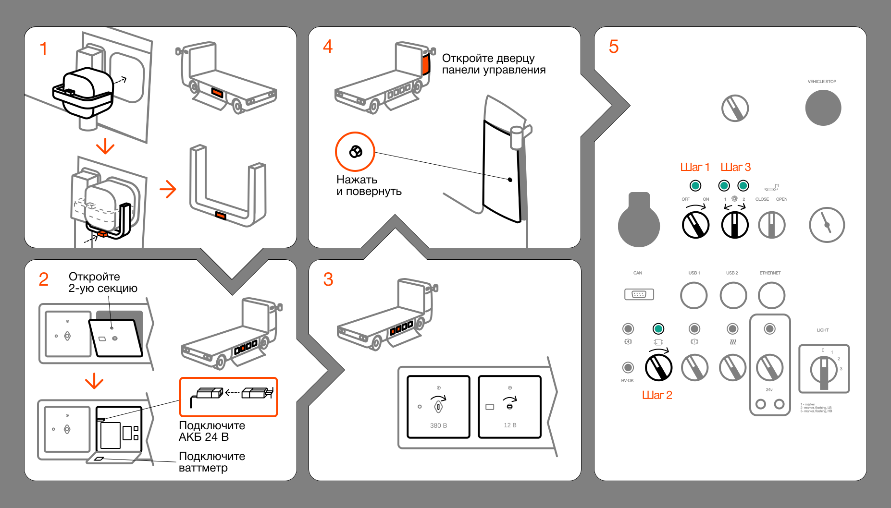
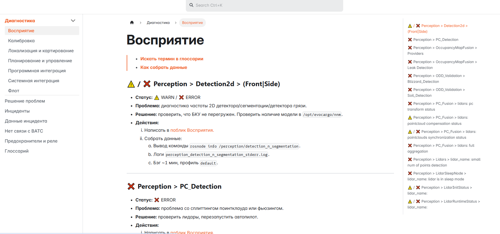
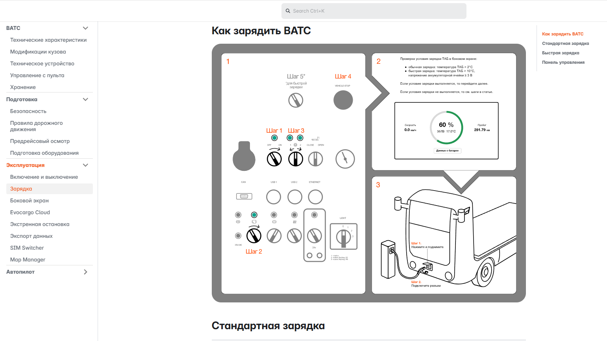
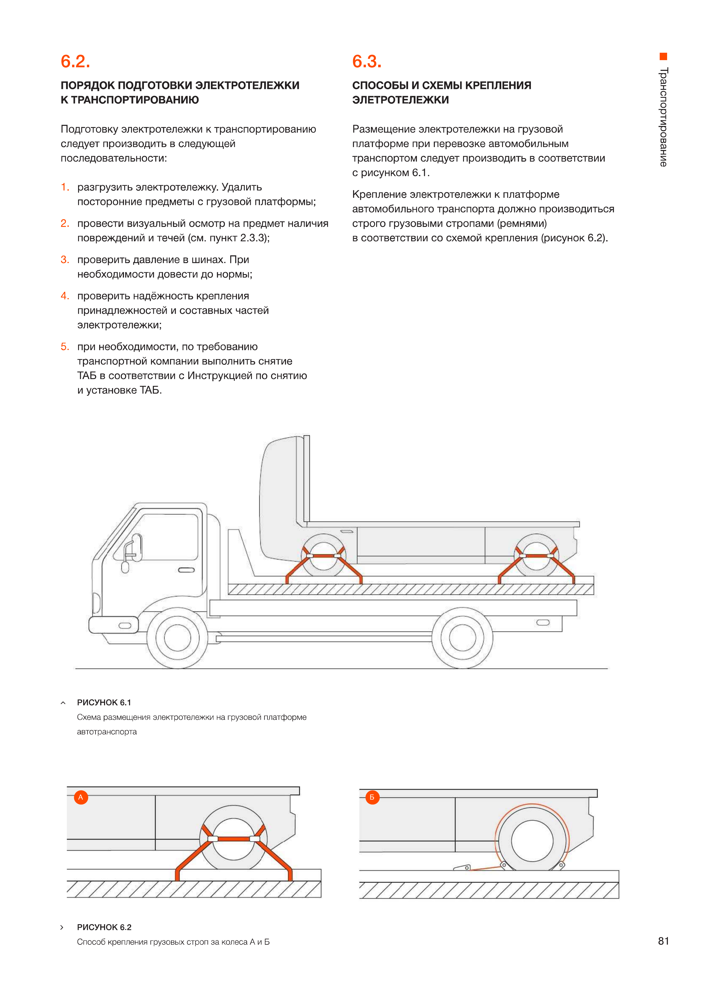

# Autonomous-engineering-docs
Autonomous trucks for logistics.

**Evocargo** is a project focused on the development of autonomous trucks for logistics operations and the provision of transportation services within warehouse facilities.

My responsibilities as a **Analyst/Systems Engineer** included:

- Designed autonomous electric commercial vehicles:
  - **N1-class vehicles** for warehouse logistics
  - **N3-class tractor units** for transportation logistics
  - More than **300 autonomous trucks** were manufactured, with **100+ vehicles deployed at customer sites**.

- Key work artifacts included:
  - PRDs, BRDs, and technical specifications (SRS/technical requirements) for vehicle development, vehicle components, and the Automated Driving System (ADS), including computer vision and ML components, control applications, localization, object detection, and motion control, with consideration of ASPICE and ISO 26262 requirements.
  - Operational and technical documentation covering vehicle operation, maintenance, storage, technical support, and related procedures for vehicle systems, including steering, braking, pneumatic systems, powertrain, transmission, battery systems, traction electric drive, and Automated Driving System (ADS).
  - Documentation was maintained in PTC Windchill PDM and delivered through an interactive web application.
  - Designed the web interface and information-display logic (UX/UI) in collaboration with UI/UX designers.

# Examples of Manual

- **[Part of turning On and Off](#-1-part-of-turning-on-and-off)**
- **Part of perception**
- **Part of charging**
- **Part of brand guidelines manual**

## **№ 1. Part of turning On and Off**

> - **Искать термин в глоссарии**
> - Перед началом работы ознакомьтесь с интерфейсом панели управления.

### **Включение ВАТС**

1. Откройте левую дверцу борта: потяните за тросики, расположенные внизу слева и справа от дверцы.

> Тросики применяются для открытия в том случае, если выключено бортовое электропитание 24 В. Если включено электропитание 24 В, то открыть боковые дверцы бортов можно с помощью кнопки на заднем боковом крыле.

2. Установите предохранитель ТАБ: 
	1. Поднимите ручку полностью и задвиньте предохранитель в розетку до упора.
	2. Опустите ручку вниз до упора и утопите язычок-фиксатор внутрь ручки до щелчка.

3. etc...

## **№ 2. Part of perception**

## **№ 3. Part of charging**

## **№ 4. Part of brand guidelines manual**

